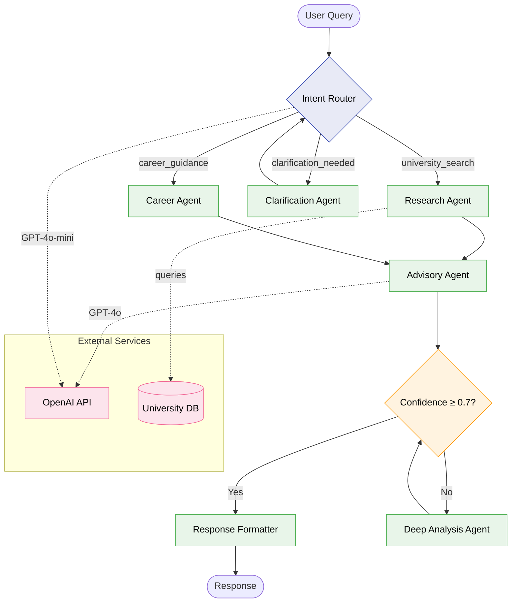

# How to write architecture docs for multi-agent AI systems

**The single most important thing your architecture documentation must do is show engineering judgment — not describe what your code does.** Technical reviewers (scholarship evaluators, hiring managers, senior engineers) spend minutes, not hours, on your docs. They scan for evidence that you can decompose complex problems, reason about trade-offs, and communicate decisions clearly. A flat file mixing topology diagrams, state schemas, bug tracking, and operational protocols in one document actively undermines that goal. This guide provides a battle-tested methodology for structuring architecture documentation that earns trust fast, drawn from how the top open-source agent frameworks actually document their systems, industry-standard templates like arc42 and C4, and the specific patterns that multi-agent LLM systems demand.

---

## What the best agent frameworks actually do (and don't do)

Before prescribing a structure, it's worth studying what works in production. Five major agent frameworks reveal **five very different documentation strategies**, and the pattern is instructive.

**AutoGen has the most formal architecture documentation** of any agent framework. Microsoft maintains a dedicated `architecture.md` inside the repo with SVG diagrams showing standalone vs. distributed agent runtimes, a layered documentation structure mapping its three API layers (Core → AgentChat → Extensions), and eight distinct multi-agent design pattern pages (concurrent agents, group chat, handoffs, debate, reflection, etc.). The documentation follows the Diátaxis framework — separating tutorials, how-to guides, conceptual guides, and API reference into distinct sections.

**LangGraph takes a different approach: conceptual documentation as first-class architecture docs.** Rather than a single architecture file, LangGraph maintains a `docs/concepts/` directory with separate files for low-level primitives (`low_level.md`), agentic patterns (`agentic_concepts.md`), multi-agent systems (`multi_agent.md`), persistence, memory, streaming, and subgraphs. Each concept file defines architectural primitives precisely — State as "a shared data structure representing the current snapshot," Nodes as "functions encoding agent logic," Edges as "functions determining execution order." LangGraph also ships built-in visualization: `graph.get_graph().draw_mermaid()` generates Mermaid code directly from your compiled graph.

**MetaGPT uniquely uses an academic paper as its primary architecture reference**, supplemented by a separate docs repository with an `rfcs/` directory for design proposals. Their `concepts.md` distills the entire architecture into two formulas: `Agent = LLM + Observation + Thought + Action + Memory` and `MultiAgent = Agents + Environment + SOP + Communication + Economy`. This is remarkably effective — it gives reviewers the mental model in seconds.

**CrewAI keeps architecture on an external docs site** (not in the repo), with a dedicated "Production Architecture" page focusing on the Flows + Crews pattern. Agent definitions live in YAML configuration files (`config/agents.yaml`, `config/tasks.yaml`), which function as declarative architecture documentation.

**OpenAI Swarm is deliberately minimal** — all documentation lives in a single README, with zero diagrams. The entire framework is ~250 lines, making the source code itself the architecture document. This works precisely because the system is simple enough to hold in your head.

The lesson: **documentation complexity should match system complexity.** A 250-line framework needs a README. A multi-agent system with conditional routing, state management, confidence-based gating, and cost optimization needs structured, multi-section architecture documentation. None of these projects mix bug tracking or implementation status into their architecture docs.

---

## The architecture document structure that works

Based on the arc42 template (created by Gernot Starke in 2005, used by thousands of projects), the C4 model (Simon Brown, basis for an O'Reilly book), and patterns from real agent framework docs, here is the recommended structure for a multi-agent AI system. **The ordering follows an inverted pyramid — most critical context first, implementation details later.**

### Section 1: System overview and design goals

Open with a **two-to-three sentence TL;DR** that captures what the system does and the key architectural insight. Follow with the problem statement (one paragraph), then list 3–5 design goals as quality attributes. This section answers: "What is this, and what does it optimize for?"

For PathFinder specifically, this would mean stating the domain (Vietnamese university/career guidance), the core architectural pattern (multi-agent orchestration with confidence-based routing), and the primary design goals (accuracy of recommendations, cost efficiency, conversational fluency in Vietnamese).

Include a **C4 Level 1 System Context diagram** here — a single Mermaid flowchart showing your system as one box surrounded by external actors and systems (users, OpenAI API, university databases, etc.). This is the most important diagram in the entire document because it establishes boundaries.

### Section 2: Architecture overview

This is the C4 Level 2 Container diagram — zoom into your system and show the major deployable/runnable components. For a LangGraph project, this means showing the state graph as the central orchestrator, with nodes representing agents, external services as separate containers, and data stores.

Include a **technology stack table with rationale**, not just a list. The table format matters:

| Component | Technology | Why this choice |
|-----------|-----------|----------------|
| Orchestration | LangGraph | Graph-based state machine with built-in persistence, conditional routing, and checkpointing — essential for multi-step advisory flows |
| LLM | OpenAI GPT-4o-mini / GPT-4o | Tiered model selection: mini for classification and routing (~$0.15/1K tokens), full for complex advisory generation |
| Validation | Pydantic v2 | Runtime type validation on state transitions prevents corrupt state propagation between agents |
| State persistence | SQLite + LangGraph checkpointer | Enables conversation resume and time-travel debugging during development |

Every row must answer "why this and not the obvious alternative." This is where you demonstrate engineering judgment rather than just listing your `requirements.txt`.

### Section 3: Agent architecture (the core of multi-agent docs)

This section does the heavy lifting. It needs four sub-components:

**Agent topology diagram.** Use a Mermaid flowchart with `subgraph` blocks to group related agents. Color-code by function (routing, analysis, generation, validation). LangGraph projects should generate this from their compiled graph using `draw_mermaid()` and then hand-edit for clarity. The auto-generated output is a starting point, not the final diagram.

**Agent registry table.** Every agent gets one row documenting its role, model assignment, input/output contract, and tools. This table is the single most scannable element in your architecture doc — reviewers will look here to understand the system's topology in 10 seconds:

| Agent | Role | Model | Reads from state | Writes to state | Tools |
|-------|------|-------|-----------------|----------------|-------|
| Router | Classify intent, select pipeline | GPT-4o-mini | `user_query`, `conversation_history` | `intent`, `selected_pipeline` | — |
| Researcher | Gather university/program data | GPT-4o | `intent`, `user_profile` | `research_results`, `sources` | Web search, DB query |
| Advisor | Generate personalized guidance | GPT-4o | `research_results`, `user_profile` | `advisory_draft`, `confidence_score` | — |
| Validator | Quality-check advisory output | GPT-4o-mini | `advisory_draft`, `confidence_score` | `validation_result`, `revision_notes` | — |

**State schema.** Document your shared state as a typed interface, not prose. For Pydantic-based LangGraph projects, include the actual Pydantic model or TypedDict with annotations explaining each field's purpose and its reducer strategy:

```python
class AdvisoryState(TypedDict):
    messages: Annotated[list, add_messages]       # Conversation history (append-only)
    user_profile: UserProfile                      # Extracted user context (overwrite)
    intent: str                                    # Classified user intent (overwrite)
    research_results: list[Source]                  # Gathered data (append)
    confidence_score: float                        # Advisory quality metric (overwrite)
    stage: Literal["intake", "research", "advisory", "review", "complete"]
```

**Orchestration flow.** Use a Mermaid sequence diagram for the primary happy path, then a state diagram for the routing logic. The sequence diagram shows *temporal flow* (what happens in order), while the state diagram shows *decision logic* (what triggers transitions). You need both — they serve different comprehension needs.

### Section 4: Key design decisions

**This is the highest-signal section for technical evaluators.** Use the Architecture Decision Record (ADR) format, either inline or as links to separate files in `/docs/adr/`. The minimal template from Michael Nygard's original pattern:

```markdown
### ADR-001: Tiered model selection for cost optimization

**Status**: Accepted

**Context**: Advisory generation requires high-quality reasoning (GPT-4o level),
but routing and classification tasks don't justify the 20x cost premium.
Average session involves 3-4 LLM calls; at GPT-4o pricing for all calls,
per-session cost would be ~$0.12, making the system economically unviable
for a free student advisory tool.

**Decision**: Use GPT-4o-mini ($0.15/1M input tokens) for routing,
classification, and validation. Use GPT-4o ($2.50/1M input tokens) only
for advisory generation where reasoning quality directly impacts user value.

**Alternatives considered**:
- Single model for everything (simpler but 8x more expensive)
- Open-source models via Ollama (lower cost but Vietnamese language quality insufficient)
- Claude Sonnet (strong reasoning but higher latency for Vietnamese text)

**Consequences**: Reduces per-session cost to ~$0.02. Adds complexity in
model configuration and prompt tuning per model. Requires separate prompt
templates optimized for each model's capabilities.
```

Include **3–5 ADRs** covering your most consequential decisions. For a multi-agent LangGraph project, these typically include: orchestration pattern choice (why supervisor vs. swarm vs. sequential), model selection strategy, state management approach, error handling/retry strategy, and any domain-specific architectural choice (like how you handle Vietnamese language processing or confidence-based routing).

### Section 5: Cost and performance architecture

This section is **unique to LLM-based systems** and demonstrates mature engineering thinking that most student projects lack entirely. Document:

**Model selection matrix** (already partially covered in the agent registry, but expanded here with cost per 1K tokens and expected token usage per call).

**Token budget management**: How you handle context window limits. Do you use sliding windows? Conversation summarization? What's your maximum context per agent call?

**Caching strategy**: What responses are cached, what the cache invalidation rules are, and what hit rate you expect or measure.

**Cost guardrails**: Per-session limits, monthly caps, model fallback chains (e.g., if GPT-4o fails, fall back to GPT-4o-mini with a disclaimer).

### Section 6: Reliability and failure modes

Document this as a **failure mode table** — it's the most efficient format and immediately signals engineering maturity:

| Failure mode | Trigger | Impact | Mitigation | Fallback |
|-------------|---------|--------|------------|----------|
| LLM hallucination | Low-confidence domain query | Incorrect university recommendation | Confidence scoring + source citation requirement | Flag for human review |
| API rate limit | >60 req/min to OpenAI | Agent stalls mid-conversation | Exponential backoff with jitter | Queue and retry with user notification |
| Token limit exceeded | Long conversation history | Truncated context → degraded response | Sliding window + conversation summarization | Split into sub-conversations |
| Agent infinite loop | Circular routing between agents | Cost explosion, no response | Max iteration limit (10 cycles) | Force termination + return partial result |
| Confidence below threshold | Ambiguous or out-of-scope query | Low-quality advisory | Route to clarification agent | Graceful "I'm not sure" response with suggested resources |

Also document your **stage-gating logic** as a state diagram. Confidence-based routing is a design pattern that evaluators will recognize as sophisticated — but only if you document the thresholds, what metric drives each gate, and what happens when the gate rejects.

### Section 7: Known limitations and future work

**Honesty here builds more trust than perfection elsewhere.** Acknowledge current technical debt, scope limitations, and scaling constraints. "The current architecture handles ~50 concurrent users; horizontal scaling would require migrating from SQLite to PostgreSQL and adding a Redis-backed session store" is exactly the kind of sentence that makes evaluators think "this person actually understands production systems."

---

## How to visualize agent systems effectively

The research across all major frameworks reveals a clear hierarchy of visualization tools for GitHub-hosted projects:

**Mermaid flowcharts are the dominant standard** for agent topology visualization. GitHub has rendered Mermaid natively since February 2022 — just use ` ```mermaid ` code blocks. They're version-controlled, diffable in pull requests, and require zero external tooling. Use `graph TD` (top-down) for pipeline architectures and `graph LR` (left-right) for parallel architectures. Use `subgraph` blocks to group related agents. Use color classes (`classDef`) to distinguish agent types.

**Mermaid sequence diagrams** are best for documenting temporal interactions between agents. They show the order of operations, which Mermaid flowcharts cannot.

**Mermaid state diagrams** (`stateDiagram-v2`) are ideal for documenting confidence-based routing and stage-gating logic, since they naturally represent conditional transitions.

**For complex architectures exceeding Mermaid's layout capabilities**, use draw.io or Excalidraw and export as PNG/SVG stored in a `/docs/diagrams/` directory. Always provide text descriptions alongside image-based diagrams.

**Never use only diagrams or only prose.** The recommended ratio across architecture documentation best practices is approximately **40% diagrams, 45% prose explanation, 15% code snippets** (schemas, interfaces, configuration examples). Every diagram needs a text explanation; every complex text section needs a supporting visual.

---

## One file or many? The file organization question

**For portfolio projects, use a single primary `ARCHITECTURE.md` with a supporting `/docs/adr/` directory.** This recommendation comes from Aleksey Kladov's influential ARCHITECTURE.md philosophy (the rust-analyzer maintainer): keep one canonical file that every contributor reads, focused on things unlikely to frequently change. Keep it to the equivalent of 4–8 printed pages.

The recommended file structure for a multi-agent LangGraph portfolio project:

```
project/
├── README.md                    # What is this? How do I run it? (entry point)
├── ARCHITECTURE.md              # System design, agent topology, decisions (this guide's output)
├── docs/
│   ├── adr/
│   │   ├── 001-orchestration-pattern.md
│   │   ├── 002-model-selection.md
│   │   ├── 003-state-management.md
│   │   └── README.md            # ADR index
│   └── diagrams/                # Source files for non-Mermaid diagrams
├── src/
│   └── agents/
│       ├── state.py             # State schema (code as documentation)
│       ├── nodes.py             # Agent node definitions
│       ├── graph.py             # Graph construction and routing
│       └── tools.py             # Agent tools
└── langgraph.json               # LangGraph deployment config
```

**Critical separation of concerns**: Architecture docs describe the system design and decision rationale. README describes setup and usage. ADRs capture individual decisions with full context. Bug tracking lives in GitHub Issues. Implementation status lives in a project board or CHANGELOG. **Never mix these.** The original problem — a flat file combining topology, protocols, schemas, and bug tracking — is the textbook "mixing concerns" anti-pattern that makes reviewers lose trust.

---

## Writing for dual audiences: the progressive disclosure pattern

Your ARCHITECTURE.md serves two audiences simultaneously: **evaluators who scan in 2–3 minutes** and **collaborators who deep-dive for 20 minutes**. Use progressive disclosure:

**Layer 1 (10-second scan)**: The TL;DR paragraph at the top, plus bolded key phrases throughout. A reviewer reading only bold text and headings should understand the system's purpose, pattern, and key architectural insight.

**Layer 2 (2-minute scan)**: Section headings (written as descriptive signposts, not generic labels), the agent registry table, the system context diagram, and the technology stack table. This layer should convey the full architecture at a conceptual level.

**Layer 3 (deep dive)**: ADRs with full context and alternatives, the failure mode table, cost architecture details, and state schema definitions. Use GitHub's collapsible sections (`<details><summary>`) for deep-dive content that would clutter the scan path:

```markdown
<details>
<summary>📐 Detailed state transition logic</summary>

[Deep content here — routing conditions, threshold values, edge case handling]

</details>
```

**Bold the 1–3 most critical facts in each section.** Front-load every paragraph with its key point. Use short sentences (under 20 words). These aren't just stylistic preferences — they're the mechanics of scannable technical writing.

---

## The anti-patterns that destroy credibility

Research on what technical reviewers penalize most heavily reveals a consistent hierarchy of documentation failures, from most to least damaging:

**Documentation that doesn't match the code** is the single worst anti-pattern. If your ARCHITECTURE.md says "Redis caching layer" but there's no Redis anywhere in the codebase, evaluators conclude you're either dishonest or careless. Both are disqualifying. Every claim in your architecture doc must be verifiable in the code.

**Missing the "why" behind decisions** is the most common gap. Listing technologies without explaining why you chose them demonstrates that you can read documentation, not that you can architect. "We use PostgreSQL" is useless. "We chose PostgreSQL over MongoDB because our data has strong relational constraints between user profiles, program requirements, and eligibility criteria, and we need ACID transactions for recommendation tracking" shows engineering judgment.

**Hand-waving about AI capabilities** is the signature anti-pattern of LLM projects. "The AI agent intelligently processes the request and returns the optimal response" tells the reviewer nothing and signals shallow understanding. Instead: specify which model, what prompt structure, what context window management, what failure modes, and what happens when the LLM returns garbage. **Treat LLMs as powerful but fallible components**, not magic boxes.

**Over-engineering the architecture for the problem scale** destroys trust with senior engineers. A student advisory chatbot doesn't need Kubernetes, event sourcing, or CQRS. Document why your complexity level matches your problem — Anthropic's own guidance distinguishes between "workflows" (predefined code paths) and "agents" (dynamic LLM-directed processes) and advises starting with the simplest pattern that works.

**Copy-pasting framework documentation** instead of explaining your design decisions. Your architecture doc should make sense even if LangGraph disappeared tomorrow. Explain what *your system* does and why, not what the framework provides.

**Inconsistent details across sections** ("detail drift") — mentioning "3 agents" in one section and "5 agents" in another — signals that the document was written hastily or that you don't fully understand your own system.

---

## A concrete Mermaid template for multi-agent topology

Here is a production-ready Mermaid template for documenting a supervisor-pattern multi-agent system, based on patterns from real LangGraph projects:



This template uses color coding by function, diamond shapes for decision points, dotted lines for external service calls, and subgraphs for service boundaries — all patterns observed in well-documented LangGraph projects.

---

## Conclusion: the methodology in five principles

The methodology distills to five principles that separate architecture docs that earn trust from those that lose it:

**Problem before solution.** Start with what you're solving and why it's hard, not with your technology stack. MetaGPT's two-formula approach (`Agent = LLM + Observation + Thought + Action + Memory`) works because it gives reviewers the mental model before the implementation.

**Decisions over descriptions.** Three well-written ADRs showing trade-off analysis demonstrate more engineering sophistication than twenty pages of system description. Every significant choice needs context, alternatives considered, and acknowledged consequences.

**Honest constraints over polished promises.** Documenting that your system handles 50 concurrent users and explaining what would need to change for 5,000 builds far more credibility than claiming "enterprise-grade scalability." Known limitations demonstrate that you've actually tested your system and understand its boundaries.

**Separation of concerns in the docs themselves.** Architecture decisions, bug tracking, implementation status, API reference, and deployment instructions serve different audiences and change at different rates. Mixing them in one file creates a document that serves no audience well.

**Scannable structure with progressive depth.** An evaluator reading only your headings, bold text, tables, and diagrams should understand the system in two minutes. A collaborator reading every section should understand enough to contribute code. The inverted pyramid structure, collapsible detail sections, and the TL;DR-first pattern make this dual-audience service possible without duplicating content.